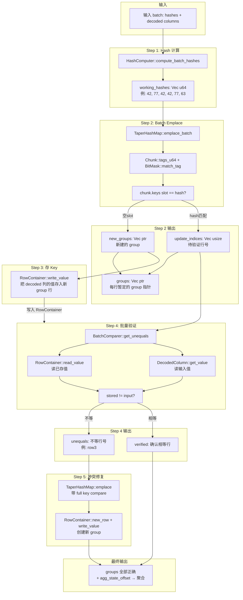

# Rust TaperHashMap 调用链与 Data Flow

## 调用链 (Call Stack)

```
emplace_table()                             // orchestrator.rs
│
├── HashComputer::compute_batch_hashes()    // hash.rs
│     └── for each col: hash_mix(hash_i64/hash_bytes)
│
├── TaperHashMap::emplace_batch()           // taper_hashmap.rs
│     └── for each row:
│           └── loop (线性探测):
│                 ├── chunk.tags_u64()      // chunk.rs
│                 ├── BitMask::match_tag()  // bitmask.rs (SWAR)
│                 │     └── 比较 tag (7-bit)
│                 ├── chunk.keys[slot] == hash  // 比较 hash (u64)
│                 ├── on_new(row_idx, &mut slot.value)    // 空 slot → 新 group
│                 │     └── RowContainer::new_row()       // row_container.rs
│                 │     └── SlotValue::set_ptr()          // chunk.rs
│                 └── on_existing(row_idx, &slot.value)   // hash 匹配 → updateList
│
├── store_key_columns()                     // orchestrator.rs
│     └── RowContainer::write_value()       // row_container.rs
│
├── BatchComparer::get_unequals()           // batch_compare.rs
│     └── compare_i64_scalar/neon()
│           ├── RowContainer::read_value()  // 读已存的值
│           └── DecodedColumn::get_value()  // 读输入的值
│           └── 不等 → swap 到前面
│
└── TaperHashMap::emplace() [修复]           // taper_hashmap.rs
      └── loop (线性探测):
            ├── BitMask::match_tag()
            ├── key_cmp(&slot.value)        // full key 比较
            │     └── RowComparer::compare_keys()
            │           └── RowContainer::read_value() vs DecodedColumn::get_value()
            ├── on_new → RowContainer::new_row() + write_value()
            └── on_match → groups[row_idx] = slot.get_ptr()
```

---

## Data Flow 图



---

## 各模块输入/输出

| 模块 | 输入 | 输出 |
|------|------|------|
| `HashComputer` | decoded columns, rows_num | `Vec<u64>` hashes |
| `TaperHashMap::emplace_batch` | hashes, on_new, on_existing | update_indices (待验证) |
| `RowContainer::new_row` | (无) | `*mut u8` 新行指针 |
| `RowContainer::write_value` | row ptr, col_idx, value | (写入行内存) |
| `BatchComparer::get_unequals` | indices, input_vals, groups, offset | unequals_num |
| `TaperHashMap::emplace` | hash, key_cmp, on_new, on_match | (修正 groups) |

---

## 数据在各结构间的流动

```
DecodedColumn (输入列)
     │
     ├──→ HashComputer ──→ hashes[]: Vec<u64>
     │                          │
     │                          ▼
     │                    TaperHashMap (chunks)
     │                          │
     │                    ┌─────┴──────┐
     │                    │            │
     │              空 slot         hash 匹配
     │                │                │
     │                ▼                ▼
     │          RowContainer      update_indices
     │          (new_row+写key)        │
     │                │                │
     │                ▼                ▼
     ├──→ BatchComparer (读 input vs 读 RowContainer)
     │                          │
     │                    ┌─────┴──────┐
     │                    │            │
     │                 相等          不等
     │                    │            │
     │                    ▼            ▼
     │               groups 确认   TaperHashMap::emplace (修复)
     │                                 │
     │                                 ▼
     │                           RowContainer (新 group)
     │
     ▼
groups[] 全部正确 → + agg_state_offset → Aggregator
```

---

## 用例子走一遍

```
输入: 6 行, GROUP BY (city, gender)
hashes = [42, 77, 42, 42, 77, 63]  (其中 row3 hash=42 是碰撞)

Step 1: HashComputer
  hashes = [42, 77, 42, 42, 77, 63]

Step 2: emplace_batch
  row0 hash=42 → chunk[X] 空 → on_new → RowContainer.new_row() = G0
  row1 hash=77 → chunk[Y] 空 → on_new → G1
  row2 hash=42 → tag+key 匹配 → on_existing → groups[2]=G0, updateList=[2]
  row3 hash=42 → tag+key 匹配 → on_existing → groups[3]=G0, updateList=[2,3]
  row4 hash=77 → tag+key 匹配 → on_existing → groups[4]=G1, updateList=[2,3,4]
  row5 hash=63 → chunk[Z] 空 → on_new → G5

Step 3: store_key_columns
  G0 ← decoded[0][0]="北京", decoded[1][0]="男"
  G1 ← decoded[0][1]="上海", decoded[1][1]="女"
  G5 ← decoded[0][5]="北京", decoded[1][5]="女"

Step 4: get_unequals
  row2: RowContainer.read(G0,col0)="北京" vs decoded[0][2]="北京" → 等 ✓
  row3: RowContainer.read(G0,col0)="北京" vs decoded[0][3]="深圳" → 不等 ✗
  row4: RowContainer.read(G1,col0)="上海" vs decoded[0][4]="上海" → 等 ✓
  unequals = [row3]

Step 5: emplace (修复 row3)
  hash=42 → chunk[X] slot[0]: key_cmp → G0 (北京,男) != (深圳,女) → false
  → 继续探测 → 空 slot → on_new → G3 ← "深圳","女"
  → groups[3] = G3

最终: groups = [G0, G1, G0, G3, G1, G5]
```
